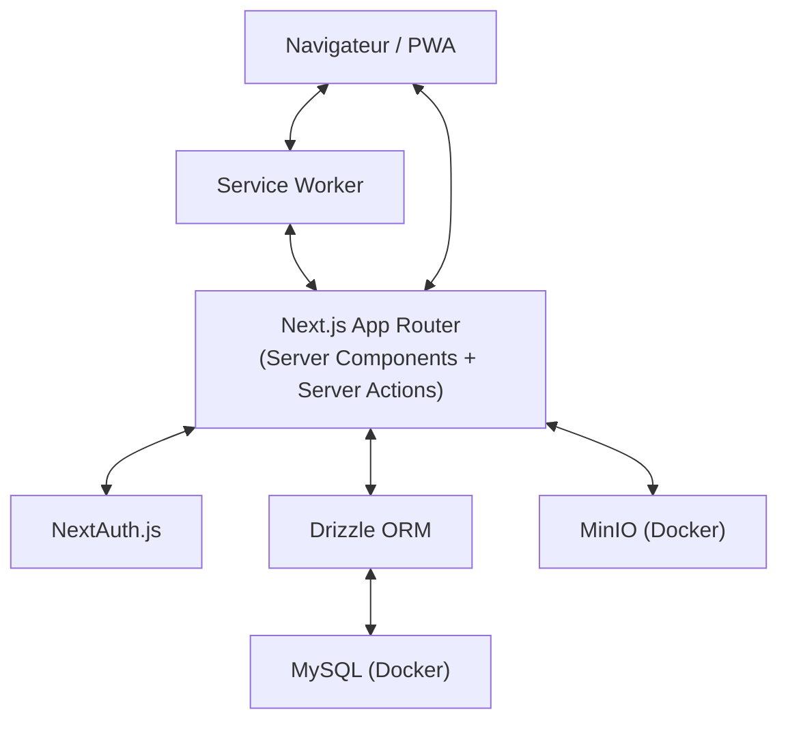
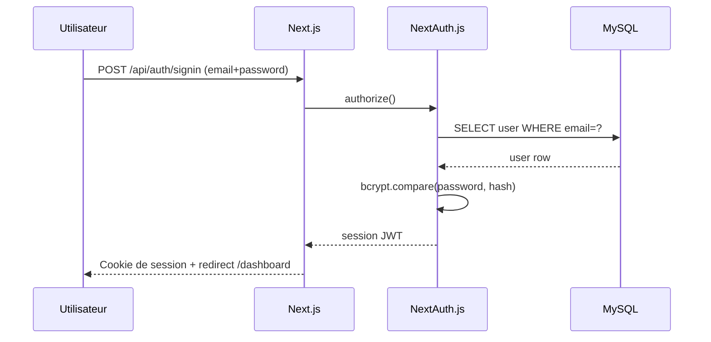
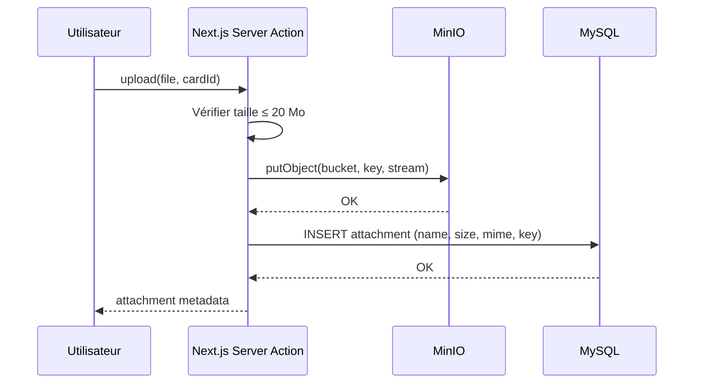
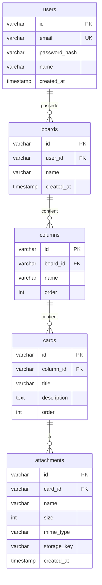

# Document de Design Technique — Task Management App

## Vue d'ensemble

L'application est une Progressive Web App (PWA) de gestion de tâches de style Kanban, construite en Next.js 15 avec l'App Router. Elle adopte une architecture fullstack : les Server Actions et les Route Handlers Next.js servent d'API, Drizzle ORM gère la persistance MySQL, et MinIO stocke les pièces jointes. L'authentification est assurée par NextAuth.js v5 / Auth.js (email/password + Google OAuth). L'interface est construite avec ShadCN/UI (Tailwind CSS v4) et le glisser-déposer est géré par `@dnd-kit`. L'infrastructure locale repose sur Docker Compose.

---

## Stack technique et versions des packages

### Dépendances de production

| Package | Version | Rôle |
|---|---|---|
| `next` | `^15.4.6` | Framework fullstack React (App Router, Server Actions) |
| `react` | `^19.2.4` | Bibliothèque UI |
| `react-dom` | `^19.2.4` | Rendu DOM React |
| `next-auth` | `^5.0.0-beta.29` | Authentification (email + Google OAuth) |
| `@auth/drizzle-adapter` | `^1.11.0` | Adaptateur Drizzle pour Auth.js |
| `drizzle-orm` | `^0.44.0` | ORM TypeScript pour MySQL |
| `mysql2` | `^3.14.0` | Driver MySQL pour Node.js |
| `minio` | `^8.0.5` | Client MinIO / S3 pour les pièces jointes |
| `@dnd-kit/core` | `^6.3.1` | Drag & drop (Kanban) |
| `@dnd-kit/sortable` | `^8.0.0` | Extension tri pour @dnd-kit |
| `zod` | `^3.25.0` | Validation des schémas TypeScript |
| `bcryptjs` | `^3.0.2` | Hachage des mots de passe |
| `tailwindcss` | `^4.1.13` | Framework CSS utilitaire |

### Dépendances de développement

| Package | Version | Rôle |
|---|---|---|
| `drizzle-kit` | `^0.30.0` | CLI migrations Drizzle |
| `typescript` | `^5.8.0` | Typage statique |
| `vitest` | `^3.2.0` | Framework de tests unitaires |
| `@testing-library/react` | `^16.3.0` | Tests composants React |
| `fast-check` | `^3.23.0` | Tests de propriétés (PBT) |
| `playwright` | `^1.52.0` | Tests end-to-end |
| `shadcn` | `^2.6.0` | CLI pour ajouter des composants ShadCN |

### Commande d'installation

```bash
npm install next@^15.4.6 react@^19.2.4 react-dom@^19.2.4 next-auth@beta \
  @auth/drizzle-adapter drizzle-orm mysql2 minio \
  @dnd-kit/core @dnd-kit/sortable zod bcryptjs

npm install -D drizzle-kit typescript vitest @testing-library/react fast-check playwright
npx shadcn@latest init
```

---

### Objectifs de design

- Séparation claire entre couche de données (Drizzle), couche métier (services) et couche présentation (composants React)
- Entités Drizzle dans des fichiers séparés pour la maintenabilité
- Sécurité par défaut : isolation des données par utilisateur, URLs signées MinIO, hachage bcrypt
- PWA installable avec cache offline via Service Worker

---

## Architecture

### Vue globale



### Flux d'authentification



### Flux de téléversement de pièce jointe



---

## Composants et Interfaces

### Structure des dossiers

```
src/
├── app/
│   ├── (auth)/
│   │   ├── login/page.tsx
│   │   └── register/page.tsx
│   ├── (app)/
│   │   ├── dashboard/page.tsx
│   │   └── boards/[boardId]/page.tsx
│   ├── api/
│   │   ├── auth/[...nextauth]/route.ts
│   │   └── attachments/[id]/download/route.ts
│   └── layout.tsx
├── components/
│   ├── board/
│   │   ├── BoardCard.tsx
│   │   ├── BoardColumn.tsx
│   │   └── KanbanBoard.tsx
│   ├── card/
│   │   ├── CardDetail.tsx
│   │   └── AttachmentList.tsx
│   └── ui/               # composants ShadCN
├── server/
│   ├── actions/          # Server Actions Next.js
│   │   ├── board.actions.ts
│   │   ├── column.actions.ts
│   │   ├── card.actions.ts
│   │   └── attachment.actions.ts
│   ├── services/         # logique métier
│   │   ├── board.service.ts
│   │   ├── card.service.ts
│   │   └── attachment.service.ts
│   └── db/
│       ├── index.ts      # connexion Drizzle
│       └── schema/       # entités séparées
│           ├── users.ts
│           ├── boards.ts
│           ├── columns.ts
│           ├── cards.ts
│           └── attachments.ts
├── lib/
│   ├── auth.ts           # config NextAuth
│   ├── minio.ts          # client MinIO
│   └── validations.ts    # schémas Zod
└── public/
    ├── manifest.json
    └── sw.js
```

### Server Actions principales

```typescript
// board.actions.ts
createBoard(name: string): Promise<Board>
renameBoard(boardId: string, name: string): Promise<void>
deleteBoard(boardId: string): Promise<void>
getUserBoards(): Promise<Board[]>

// column.actions.ts
addColumn(boardId: string, name: string): Promise<Column>
reorderColumns(boardId: string, orderedIds: string[]): Promise<void>
renameColumn(columnId: string, name: string): Promise<void>
deleteColumn(columnId: string): Promise<void>

// card.actions.ts
createCard(columnId: string, title: string, description?: string): Promise<Card>
moveCard(cardId: string, targetColumnId: string, newOrder: number): Promise<void>
updateCard(cardId: string, data: Partial<CardUpdate>): Promise<void>
deleteCard(cardId: string): Promise<void>

// attachment.actions.ts
uploadAttachment(cardId: string, file: File): Promise<Attachment>
deleteAttachment(attachmentId: string): Promise<void>
getDownloadUrl(attachmentId: string): Promise<string>
```

### Composants UI clés

| Composant | Rôle |
|---|---|
| `KanbanBoard` | Conteneur DnD, orchestre colonnes et cartes |
| `BoardColumn` | Colonne droppable, liste de `BoardCard` |
| `BoardCard` | Carte draggable, aperçu titre + badges |
| `CardDetail` | Modal de détail : édition, pièces jointes |
| `AttachmentList` | Liste des fichiers avec download/delete |

---

## Modèles de données

### Schéma Drizzle (MySQL)

#### `users.ts`

```typescript
export const users = mysqlTable('users', {
  id: varchar('id', { length: 36 }).primaryKey().$defaultFn(() => crypto.randomUUID()),
  email: varchar('email', { length: 255 }).notNull().unique(),
  passwordHash: varchar('password_hash', { length: 255 }),  // null si OAuth uniquement
  name: varchar('name', { length: 255 }),
  image: varchar('image', { length: 500 }),
  createdAt: timestamp('created_at').defaultNow().notNull(),
});
```

#### `boards.ts`

```typescript
export const boards = mysqlTable('boards', {
  id: varchar('id', { length: 36 }).primaryKey().$defaultFn(() => crypto.randomUUID()),
  userId: varchar('user_id', { length: 36 }).notNull().references(() => users.id, { onDelete: 'cascade' }),
  name: varchar('name', { length: 255 }).notNull(),
  createdAt: timestamp('created_at').defaultNow().notNull(),
  updatedAt: timestamp('updated_at').defaultNow().onUpdateNow().notNull(),
});
```

#### `columns.ts`

```typescript
export const columns = mysqlTable('columns', {
  id: varchar('id', { length: 36 }).primaryKey().$defaultFn(() => crypto.randomUUID()),
  boardId: varchar('board_id', { length: 36 }).notNull().references(() => boards.id, { onDelete: 'cascade' }),
  name: varchar('name', { length: 255 }).notNull(),
  order: int('order').notNull(),
  createdAt: timestamp('created_at').defaultNow().notNull(),
});
```

#### `cards.ts`

```typescript
export const cards = mysqlTable('cards', {
  id: varchar('id', { length: 36 }).primaryKey().$defaultFn(() => crypto.randomUUID()),
  columnId: varchar('column_id', { length: 36 }).notNull().references(() => columns.id, { onDelete: 'cascade' }),
  title: varchar('title', { length: 500 }).notNull(),
  description: text('description'),
  order: int('order').notNull(),
  createdAt: timestamp('created_at').defaultNow().notNull(),
  updatedAt: timestamp('updated_at').defaultNow().onUpdateNow().notNull(),
});
```

#### `attachments.ts`

```typescript
export const attachments = mysqlTable('attachments', {
  id: varchar('id', { length: 36 }).primaryKey().$defaultFn(() => crypto.randomUUID()),
  cardId: varchar('card_id', { length: 36 }).notNull().references(() => cards.id, { onDelete: 'cascade' }),
  name: varchar('name', { length: 255 }).notNull(),
  size: int('size').notNull(),           // en octets
  mimeType: varchar('mime_type', { length: 127 }).notNull(),
  storageKey: varchar('storage_key', { length: 500 }).notNull(),  // clé objet MinIO
  createdAt: timestamp('created_at').defaultNow().notNull(),
});
```

### Relations Drizzle

```typescript
// dans un fichier relations.ts centralisé
export const usersRelations = relations(users, ({ many }) => ({
  boards: many(boards),
}));

export const boardsRelations = relations(boards, ({ one, many }) => ({
  user: one(users, { fields: [boards.userId], references: [users.id] }),
  columns: many(columns),
}));

export const columnsRelations = relations(columns, ({ one, many }) => ({
  board: one(boards, { fields: [columns.boardId], references: [boards.id] }),
  cards: many(cards),
}));

export const cardsRelations = relations(cards, ({ one, many }) => ({
  column: one(columns, { fields: [cards.columnId], references: [columns.id] }),
  attachments: many(attachments),
}));
```

### Diagramme entité-relation




---

## Propriétés de Correction

*Une propriété est une caractéristique ou un comportement qui doit être vrai pour toutes les exécutions valides d'un système — c'est essentiellement un énoncé formel de ce que le système doit faire. Les propriétés servent de pont entre les spécifications lisibles par l'humain et les garanties de correction vérifiables par la machine.*

### Propriété 1 : Round-trip inscription → connexion

*Pour tout* email valide et mot de passe valide, inscrire un utilisateur puis tenter de se connecter avec les mêmes identifiants doit réussir et retourner une session authentifiée.

**Valide : Requirements 1.1, 1.2**

---

### Propriété 2 : Identifiants invalides retournent une erreur générique

*Pour tout* couple (email, mot de passe) où l'email n'existe pas en base ou le mot de passe ne correspond pas, la tentative de connexion doit retourner une erreur sans préciser quel champ est incorrect.

**Valide : Requirements 1.3**

---

### Propriété 3 : Unicité de l'email à l'inscription

*Pour tout* utilisateur déjà inscrit, tenter de créer un second compte avec le même email doit être rejeté avec un message d'erreur.

**Valide : Requirements 1.4**

---

### Propriété 4 : Mots de passe stockés hachés

*Pour tout* utilisateur créé avec un mot de passe, la valeur stockée dans la colonne `password_hash` ne doit jamais être égale au mot de passe en clair.

**Valide : Requirements 1.5**

---

### Propriété 5 : Déconnexion invalide la session

*Pour tout* utilisateur authentifié, après déconnexion, toute tentative d'accès à une route protégée doit être rejetée (redirection vers login ou erreur 401).

**Valide : Requirements 1.6**

---

### Propriété 6 : Callback OAuth crée ou associe un utilisateur

*Pour tout* profil OAuth Google valide (avec email), après le callback d'autorisation, exactement un utilisateur avec cet email doit exister en base de données (pas de doublon).

**Valide : Requirements 2.2, 2.4**

---

### Propriété 7 : Round-trip création d'entité

*Pour tout* tableau, colonne ou carte créé avec un nom/titre valide, relire l'entité depuis la base de données doit retourner les mêmes données que celles soumises à la création.

**Valide : Requirements 3.1, 4.1, 5.1**

---

### Propriété 8 : Mise à jour persistée

*Pour tout* tableau, colonne ou carte existant, après une opération de renommage ou de mise à jour, relire l'entité doit retourner les nouvelles valeurs.

**Valide : Requirements 3.2, 4.3, 5.3**

---

### Propriété 9 : Cascade de suppression

*Pour tout* tableau supprimé, aucune colonne ni carte ni pièce jointe associée ne doit subsister en base de données. De même, pour toute colonne supprimée, aucune carte associée ne doit subsister. Pour toute carte supprimée, aucune pièce jointe associée ne doit subsister en base ni dans MinIO.

**Valide : Requirements 3.3, 4.4, 5.4**

---

### Propriété 10 : Isolation des tableaux par utilisateur

*Pour tout* ensemble d'utilisateurs avec leurs tableaux respectifs, la liste des tableaux retournée pour un utilisateur donné ne doit contenir que les tableaux dont il est propriétaire.

**Valide : Requirements 3.4**

---

### Propriété 11 : Contrôle d'accès 403

*Pour tout* tableau appartenant à un utilisateur A, toute tentative d'accès (lecture, modification, suppression) par un utilisateur B différent doit retourner une erreur 403.

**Valide : Requirements 3.5**

---

### Propriété 12 : Réordonnancement des colonnes persisté

*Pour toute* permutation valide d'IDs de colonnes d'un tableau, après l'opération de réordonnancement, l'ordre retourné par la base de données doit correspondre exactement à la permutation demandée.

**Valide : Requirements 4.2, 4.5**

---

### Propriété 13 : Déplacement de carte persisté

*Pour toute* carte et toute colonne cible valide, après l'opération de déplacement, la carte doit appartenir à la colonne cible avec l'ordre spécifié, et les ordres des autres cartes dans les colonnes source et cible doivent rester cohérents (pas de doublons d'ordre).

**Valide : Requirements 5.2, 5.5**

---

### Propriété 14 : Round-trip upload de pièce jointe

*Pour tout* fichier valide (≤ 20 Mo) téléversé sur une carte, les métadonnées retournées (nom, taille, type MIME, date) doivent correspondre aux données du fichier original, et le fichier doit être accessible dans MinIO via la clé de stockage.

**Valide : Requirements 6.1, 6.5**

---

### Propriété 15 : URL signée non-vide avec expiration

*Pour toute* pièce jointe existante, `getDownloadUrl` doit retourner une URL non-vide contenant un paramètre d'expiration (ex. `X-Amz-Expires`).

**Valide : Requirements 6.2**

---

### Propriété 16 : Suppression atomique pièce jointe

*Pour toute* pièce jointe supprimée, ni les métadonnées en base ni le fichier dans MinIO ne doivent être accessibles après l'opération.

**Valide : Requirements 6.3**

---

### Propriété 17 : Rejet des fichiers trop volumineux (edge case)

*Pour tout* fichier dont la taille dépasse 20 Mo, la tentative d'upload doit être rejetée avec une erreur, et aucune métadonnée ne doit être insérée en base de données.

**Valide : Requirements 6.4**

---

### Propriété 18 : Atomicité en cas d'indisponibilité MinIO (edge case)

*Pour toute* tentative d'upload lorsque MinIO retourne une erreur, aucune métadonnée ne doit être persistée en base de données (pas d'entrée orpheline).

**Valide : Requirements 6.6**

---

### Propriété 19 : Synchronisation offline→online

*Pour toute* action effectuée hors ligne (création/modification de carte), après rétablissement de la connexion, l'état du serveur doit refléter ces actions.

**Valide : Requirements 8.4**

---

## Gestion des erreurs

### Stratégie générale

Toutes les Server Actions retournent un type discriminé `ActionResult<T>` :

```typescript
type ActionResult<T> =
  | { success: true; data: T }
  | { success: false; error: string; code?: string };
```

Les erreurs sont catégorisées :

| Catégorie | Code | Comportement |
|---|---|---|
| Validation | `VALIDATION_ERROR` | Retourner les champs invalides, afficher inline |
| Autorisation | `FORBIDDEN` | HTTP 403, redirection ou toast |
| Non trouvé | `NOT_FOUND` | HTTP 404, redirection vers dashboard |
| Conflit | `CONFLICT` | Message spécifique (ex. email déjà utilisé) |
| Stockage | `STORAGE_ERROR` | Toast d'erreur, rollback DB si nécessaire |
| Serveur | `INTERNAL_ERROR` | Toast générique, log serveur |

### Cas spécifiques

**Authentification**
- Identifiants invalides → message générique "Email ou mot de passe incorrect" (pas de distinction)
- Email déjà utilisé → message spécifique à l'inscription uniquement
- Session expirée → redirection automatique vers `/login`

**Pièces jointes**
- Fichier > 20 Mo → rejet avant envoi (validation côté client + serveur)
- MinIO indisponible → transaction DB annulée, aucune métadonnée orpheline
- Clé MinIO introuvable → erreur 404 sur le téléchargement

**Glisser-déposer**
- Échec de persistance de l'ordre → rollback optimiste UI vers l'état précédent + toast d'erreur

**PWA / Offline**
- Actions hors ligne stockées dans IndexedDB avec statut `pending`
- Conflit de synchronisation → stratégie "server wins" par défaut

---

## Stratégie de tests

### Approche duale

Les tests combinent deux approches complémentaires :
- **Tests unitaires** : exemples concrets, cas limites, conditions d'erreur
- **Tests de propriétés** : propriétés universelles vérifiées sur des entrées générées aléatoirement

### Tests unitaires

Focalisés sur :
- Exemples d'intégration (callback OAuth, manifest PWA, structure docker-compose)
- Cas limites (fichier exactement à 20 Mo, email avec caractères spéciaux)
- Conditions d'erreur (MinIO indisponible, session expirée)
- Composants UI (présence du toast, indicateur de chargement)

Framework : **Vitest** + **Testing Library** pour les composants React.

Exemples de tests unitaires :
- Vérifier que `manifest.json` contient `name`, `icons`, `theme_color`
- Vérifier que le fichier `.env.example` contient toutes les variables requises
- Vérifier que les fichiers de schéma Drizzle existent séparément
- Simuler une erreur MinIO et vérifier l'absence de métadonnées en base

### Tests de propriétés

Chaque propriété de correction est implémentée par **un seul test de propriété** avec minimum **100 itérations**.

Framework : **fast-check** (TypeScript/JavaScript).

Format de tag obligatoire pour chaque test :
```
// Feature: task-management-app, Property {N}: {texte de la propriété}
```

Tableau de correspondance propriétés → tests :

| Propriété | Test de propriété | Générateurs |
|---|---|---|
| P1 : Round-trip inscription→connexion | `fc.string()` pour email/password valides | `fc.emailAddress()`, `fc.string({ minLength: 8 })` |
| P2 : Identifiants invalides | Paires (email inexistant, password aléatoire) | `fc.emailAddress()`, `fc.string()` |
| P3 : Unicité email | Même email, deux inscriptions | `fc.emailAddress()` |
| P4 : Mots de passe hachés | Tout password → hash ≠ plaintext | `fc.string({ minLength: 1 })` |
| P5 : Déconnexion invalide session | Toute session → accès refusé après logout | Session mock |
| P6 : Callback OAuth | Tout profil OAuth → 1 utilisateur en base | `fc.record({ email: fc.emailAddress(), name: fc.string() })` |
| P7 : Round-trip création | Tout nom valide → lecture = création | `fc.string({ minLength: 1, maxLength: 255 })` |
| P8 : Mise à jour persistée | Tout nouveau nom → lecture = nouveau nom | `fc.string({ minLength: 1, maxLength: 255 })` |
| P9 : Cascade suppression | Tout tableau/colonne/carte → enfants supprimés | Arbres générés aléatoirement |
| P10 : Isolation utilisateurs | Tout ensemble d'utilisateurs → pas de fuite | `fc.array(fc.record(...))` |
| P11 : Contrôle d'accès 403 | Tout tableau A → accès B = 403 | UUIDs aléatoires |
| P12 : Réordonnancement colonnes | Toute permutation → ordre persisté | `fc.shuffledSubarray(ids)` |
| P13 : Déplacement carte | Toute carte + colonne cible → ordre cohérent | IDs aléatoires, ordres entiers |
| P14 : Round-trip upload | Tout fichier ≤ 20 Mo → métadonnées correctes | `fc.uint8Array()` avec taille bornée |
| P15 : URL signée | Toute pièce jointe → URL avec expiration | Pièces jointes mockées |
| P16 : Suppression atomique | Toute pièce jointe → inaccessible après delete | Pièces jointes créées en setup |
| P17 : Rejet > 20 Mo | Tout fichier > 20 Mo → rejeté, pas de métadonnée | `fc.integer({ min: 20971521 })` pour la taille |
| P18 : Atomicité MinIO KO | MinIO KO → aucune métadonnée en base | MinIO mock qui lève une erreur |
| P19 : Sync offline→online | Toute action offline → reflétée après reconnexion | Actions mockées en IndexedDB |

### Configuration fast-check

```typescript
// vitest.config.ts
import { defineConfig } from 'vitest/config';

export default defineConfig({
  test: {
    globals: true,
    environment: 'node',
  },
});

// Dans chaque test de propriété :
import fc from 'fast-check';

test('P1: Round-trip inscription→connexion', () => {
  // Feature: task-management-app, Property 1: round-trip inscription→connexion
  fc.assert(
    fc.asyncProperty(
      fc.emailAddress(),
      fc.string({ minLength: 8 }),
      async (email, password) => {
        await registerUser(email, password);
        const session = await signIn(email, password);
        return session !== null;
      }
    ),
    { numRuns: 100 }
  );
});
```

### Tests d'intégration

Pour les flux complets (OAuth, Docker Compose, PWA) :
- Utiliser **Playwright** pour les tests end-to-end
- Mocker les services externes (Google OAuth) avec des intercepteurs réseau
- Tester le Service Worker avec l'API `navigator.serviceWorker` dans un environnement contrôlé
